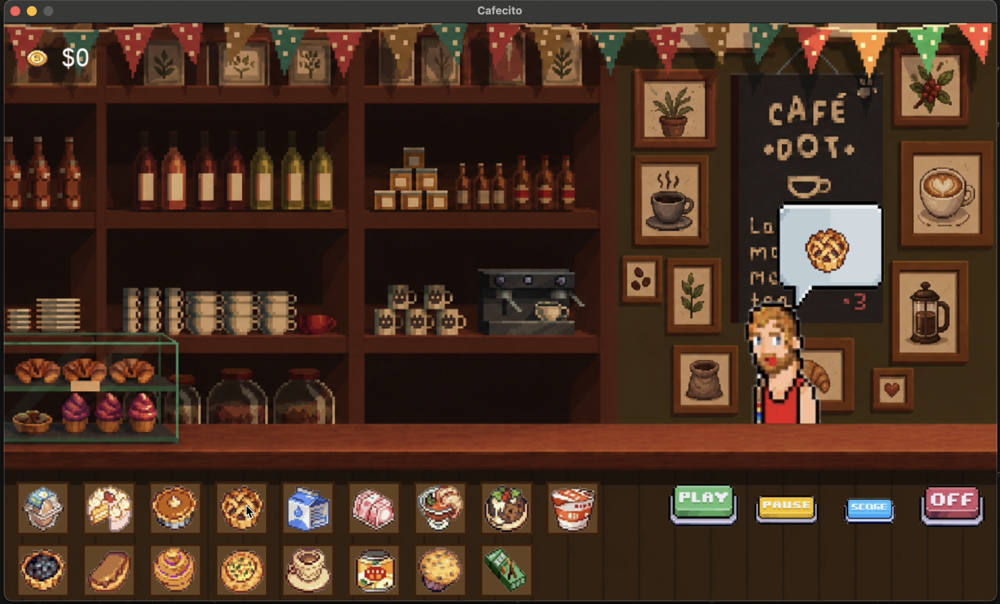
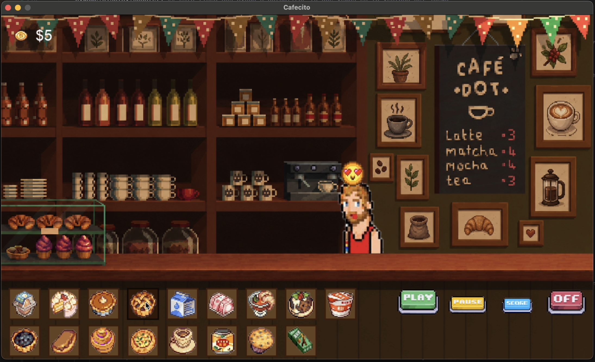
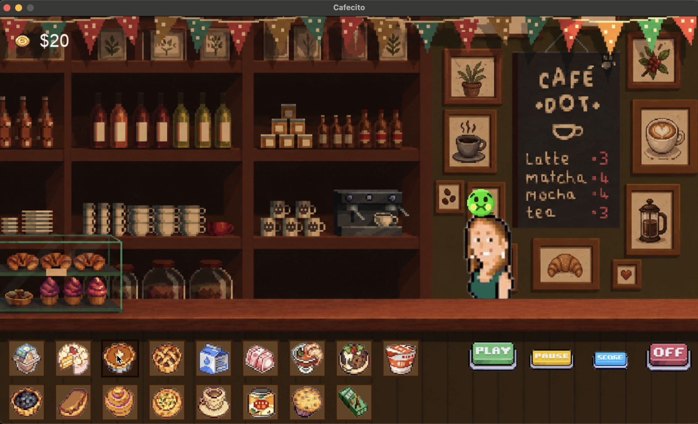
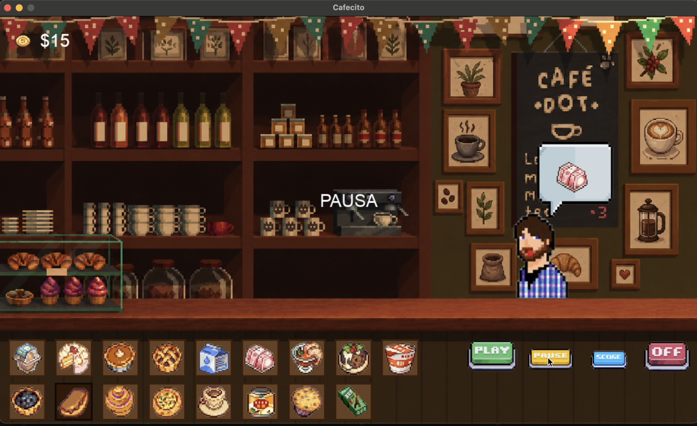
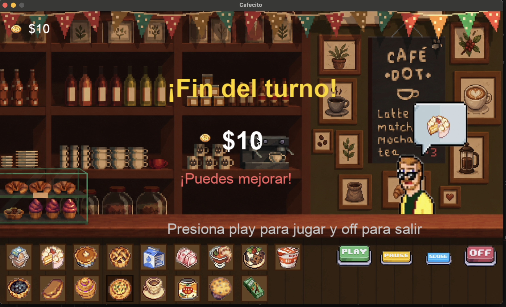

# ☕ Cafecito | Juego de Cafetería en Python + Pygame

¡Bienvenida a **Cafecito**! 🍰✨  
Un juego desarrollado en **Python** utilizando **Pygame**, donde administras una cafetería atendiendo clientes y entregando sus pedidos antes de que se vayan.

Cada cliente llega con una orden aleatoria y el objetivo es seleccionar correctamente el alimento solicitado para ganar monedas 💰.

---

## 🎮 Vista del juego

### Pantalla principal


### Pedido correcto


### Pedido incorrecto


### Pausa


### Score final


---

## ✨ Características

☕ Interfaz gráfica desarrollada con **Pygame**  
🍩 Clientes seleccionados aleatoriamente  
🧁 Órdenes dinámicas sin repetición  
💬 Sistema visual de burbujas de pedido  
💰 Contador de monedas en tiempo real  
❤️ Reacciones del cliente (pedido correcto / incorrecto)  
🎵 Música de fondo y efectos de sonido  
⏸ Sistema de pausa  
🏆 Pantalla final con puntuación  
🎲 Generación aleatoria de clientes y alimentos  

---

## 🧠 ¿Cómo funciona?

El juego selecciona:

- **3 clientes aleatorios**
- **3 órdenes aleatorias**
- Cada cliente entra caminando a la cafetería
- Aparece una burbuja mostrando su pedido
- El jugador selecciona un alimento del menú
- Dependiendo del resultado:
  - ✅ Pedido correcto → ganas monedas
  - ❌ Pedido incorrecto → pierdes monedas

Cuando termina el turno puedes consultar tu **score final**.

---

## 🛠 Tecnologías utilizadas

- Python
- Pygame
- Pygame Mixer
- Random

---

## 📂 Estructura del proyecto

```plaintext
📁 Cafecito
│
├── main_final.py
├── main.py                 # Versión inicial del proyecto
│
├── cafeteria.mp3
├── bien.wav
├── mal.wav
│
├── conmenu.png
├── logo_cafe.png
├── burbujititaa.png
├── monedita.png
│
├── cliente_1.png
├── cliente_2.png
├── ...
├── cliente_25.png
│
├── huevo.png
├── pastelito.png
├── paycrema.png
├── ...
│
├── jugar.png
├── pausa.png
├── score.png
├── salir.png
│
└── README.md
```

---

## 🚀 Instalación

Clona el repositorio:

```bash
git clone URL_DEL_REPOSITORIO
```

Entra al proyecto:

```bash
cd Cafecito
```

Instala dependencias:

```bash
pip install pygame
```

Ejecuta:

```bash
python cafee.py
```

---

## 🎯 Controles

| Acción | Método |
|--------|--------|
| Seleccionar alimento | Click izquierdo |
| Jugar | Botón Play |
| Pausar | Botón Pause |
| Ver puntuación | Botón Score |
| Salir | Botón Off |

---

## 💰 Sistema de puntuación

| Acción | Resultado |
|---------|----------|
| Pedido correcto | +5 monedas |
| Pedido incorrecto | -5 monedas |

Resultado final:

⭐ +50 → Excelente trabajo  
✨ +20 → Buen trabajo  
☕ Menos de 20 → Puedes mejorar  

---

## 🧩 Versiones del proyecto

### `main.py`
Primera versión del juego utilizada para pruebas y construcción de mecánicas.

### `cafee.py`
Versión completa del proyecto con:

- interfaz terminada
- sistema de clientes
- sonidos
- score final
- animaciones
- botones funcionales

---

## 🌸 Autor

Desarrollado por **Evelyn Sosa**  
Proyecto realizado como práctica de desarrollo de videojuegos con Python y Pygame.

---

⭐ Si te gustó el proyecto, puedes dejar una estrella en el repositorio.
